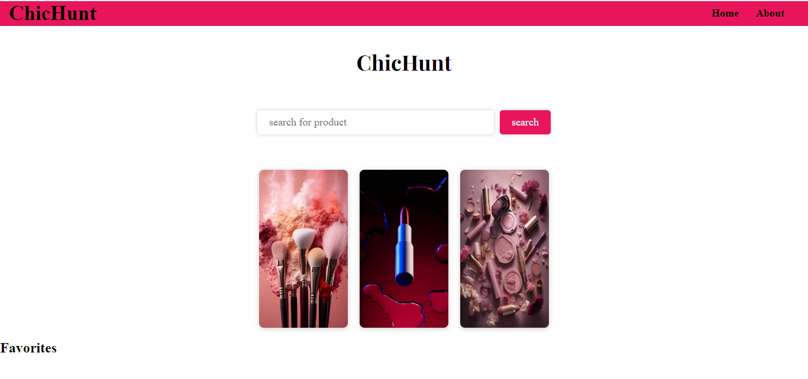

# Makeup Search App

## Author
-- [Blessing Moraa](https://github.com/Blessing886)

## Link to live site
-- (https://blessing886.github.io/cosmetic-search-app/)

## Overview
The **Makeup Search App** allows users to search for makeup products with ease. It features a dynamic function that removes the need to click a search button. users can click on a product's link to view detailed information and add products to a favorites list.

## Technologies Used
- **HTML**: Structure of the web application.
- **CSS**: Styling of the web application.
- **JavaScript**: web application interactivity.
- **Makeup API**: Source of makeup data.

## Getting Started

### Prerequisites
- Ensure you have a web browser installed and internet connection to fetch data from the API.

### Installation
1. Clone the repository:
https://github.com/Blessing886/cosmetic-search-app.git
2. Navigate to the "cosmetic-search-app" directory and open the "index.html" file in your browser.

## Usage
- Type in the serch bar to look for makeup products by product type.
- Click on a products link to view the products information.
- Use the favorites feature to add a product to the favorites list.

## API Reference
This app fetches it data from the[Makeup API] (http://makeup-api.herokuapp.com/). You can learn more about the API [here] (https://makeup-api.herokuapp.com/api/v1/products.json).

## Future Enhancements
- Adding more search filters like product rating, brand and price range.
- Improve the dynamic search interactivity.
- Enable a users favorites list to persist.

## Licence
This project is licensed under the MIT License - see the [LICENSE](LICENSE) file for details.
